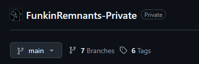
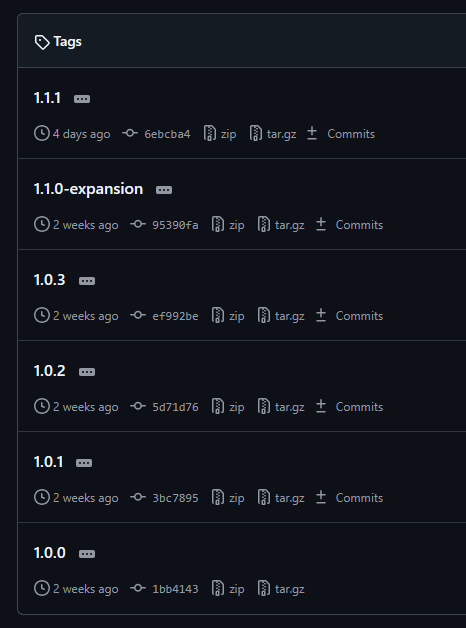
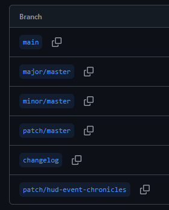

# Keeping Remnants Organized: A behind-the-scenes look at how Remnants Crew is organized.

## Introduction
Hello peoples!

If you didn't know already, my name is Til, and I am one of the main programmers on Funkin' Remnants. I am also the main organizer of the GitHub repositories, making sure things are where they are, while keeping every commit intact so that people can take a look at our development!

Doing all of this sounds quite difficult, and I'll let you know that it is. This requires a lot, and I mean a LOT of organizing behind the scenes. You need to make sure you don't leak any upcoming content in any commit at all. You shouldn't even mention it! Don't worry about it though, once you start organizing, it'll eventually click and turn into a walk in the park.

This document will tell you everything that I've learned about organizing while working on this mod. Giving you helpful directions to how you should be organizing! Just know that this document is still very Work in Progress. I need to still put some important things down.

## Branching and Tagging
Here is a cropped screenshot of the private repository:

For the `FunkinRemnants-Private` repository, we have 6 tags, and 7 branches... god damn it.

What are branches? What are tags? That's what this section is for.

### Tags
Here are all the tags we have in Funkin' Remnants:

If you haven't noticed yet, tags keep track of our releases. To be more exact, they keep track of the commits included in each version.

If you didn't know, Funkin' Remnants follows something called [Semantic Versioning](https://semver.org/spec/v2.0.0.html). In summary, we increase our versions in a way that tells you what this version does without needing to look at the Changelog.

Our versions are formatted as "`MAJOR`.`MINOR`.`PATCH`".
We increase as follows:
- `MAJOR`
  - When we release an extreme amount of content.
  - For example, *The Pico Mixes Update* will be `2.0.0`.
  - This is like a Destination Update for Funkin'.
- `MINOR`
  - When we release a small amount of content.
  - For example, *The April Fools Update* was `1.1.0-expansion`.
    - The `-expansion` suffix doesn't really mean anything.
  - This is like a Pitstop Update for Funkin'.
- `PATCH`
  - When we release small bug fixes, shouldn't include content unless it's really small.
  - For example, *The Emergency Freeplay Fix* was `1.1.1`.

### Branches
Have you ever wondered what `main` means on a GitHub repository? That's your branch! I won't explain what a branch is for this section, you can read [The Git Book](https://git-scm.com/book/en/v2/Git-Branching-Branches-in-a-Nutshell) for that.

Let's take a look at all the branches there are, shall we?

I'll explain each in detail:
- `main`
  - Basically our mirror of the public repository.
  - Before we push anything publicly, we put it here.
- `changelog`
  - Literally includes one singular file: `CHANGELOG.md`
  - As we work on an update, we write a changelog. We do this during the update instead of at the end to make sure that we don't miss anything.
  - This branch is Sammys Paradise. I will not elaborate.
- `patch/master`, `minor/master`, `major/master`
  - Our `main` branch for each update.
    - It ends with `master` due to Gits default branch name being `master`.
    - It sounds cooler than `main` in my opinion...
  - The text before the slash tells us what version to increase.
  - They all parent off of each other:
    - `patch` parents `main`
    - `minor` parents `patch`
    - `major` parents `minor`
  - Once it's finished, it gets merged to `main` as a Pull Request.
- `patch/hud-event-chronicles`:
  - A Pull Request for moving HUD fade-outs and fade-ins into an event.
  - This changes the events and scripts of almost all songs.
  - It is done as a PR to make sure it is working as intended and has no obvious bugs.
  - It should not be merged unless approved by 2 people who aren't authors.

## Rewriting History
Sometimes, we are ready to release an update. Usually, we can just merge our `master` branch to `main`. But sometimes before you release you need to change the history. Maybe you have content you can't release yet. Maybe you need to go back and split a big commit up into pieces. There are a lot of things that could happen.

You don't need to delay the release, you could just go rewrite the history! I needed to do this for the first remnants patch, because we weren't as organized as we are now. We had our changes all over the place, everything in one patch. That's where our trusty friend, Git Interactive Rebase comes in. There is probably an easier way to do this, but rebasing has always worked well with me.

I'd recommend reading [this](https://git-scm.com/book/en/v2/Git-Branching-Rebasing) before continuing. You should also have a basic understanding of how to use a Command Prompt.

1. Open Command Prompt
    - Open your Command Prompt, making sure that the current directory is your repository.
2. Finding your base commit
    - Since rebases work by putting commits on top of a *base* commit, you need to tell Git what to use for its base.
    - This base needs to be the commit hash.
3. Starting the rebase
    - Run `git rebase -i [HASH]`, replacing `[HASH]` with the base commit.
    - This should open up the Rebase TODO.
4. Working with the Rebase TODO
    - This is where you tell Git what you want to do for this rebase.
    - You will see a list of `pick`, a commit hash, and the name of the commit.
    - If you scroll down, you'll see a comment from Git telling you what you can replace `pick` with.
      - I would recommend using `edit` for rewriting the commit.
5. Editing a Commit
    - If you used `edit` in this rebase, great! I will tell you how to do the most common problems with a commit.
    - Running `git reset HEAD^` will remove the commit you chose to edit. Not completely, don't worry. It will put the changes of that commit into your local changes.
    - You can now do whatever with the changes, everything works just like normal.
    - Once you are finished rewriting that commit, you can commit it, but don't push! Run `git rebase --continue` instead to continue the rebase.
6. Force-Pushing the new History
    - Since you just completely rewrote the history, you need to force-push to put it back on GitHub.
    - You can use `git push --force` to force-push.
    - Just know that this will snap any changes you don't currently have out of the current branch.
    - I'd recommend making a seperate branch and pushing to that until you are sure that everything works how it should.

If anything doesn't make sense here, or you have any questions, [Google](https://www.google.com) it! I am sure someone has asked your question already.
